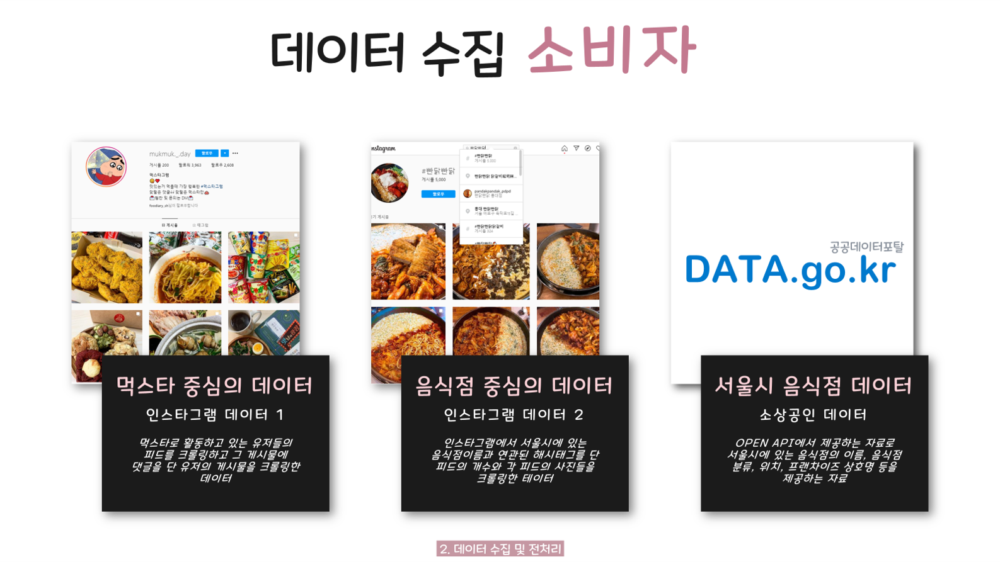
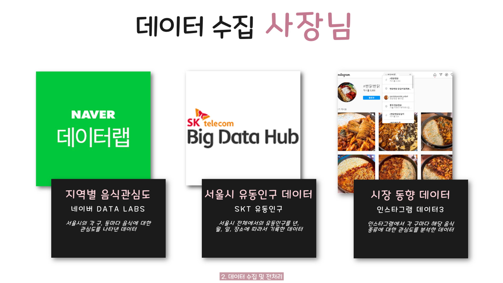
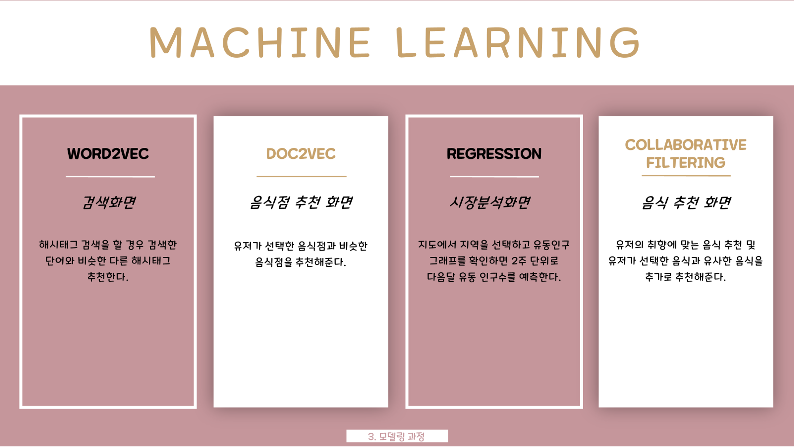
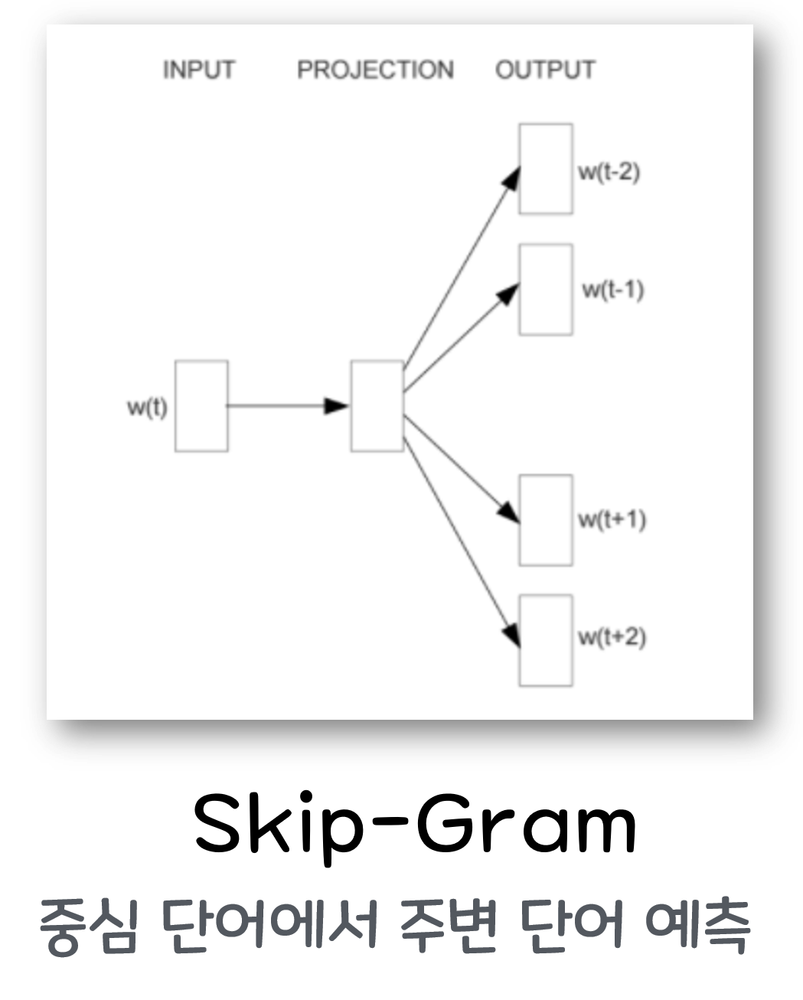
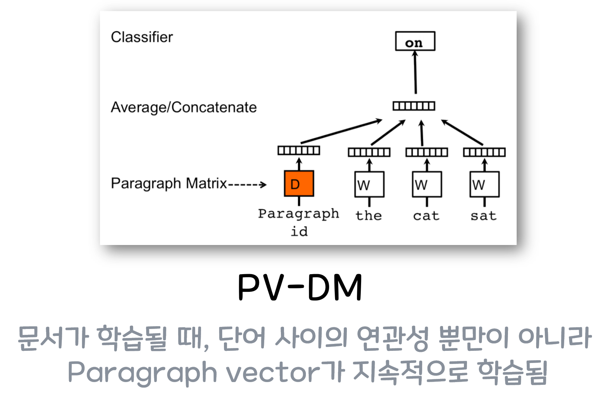
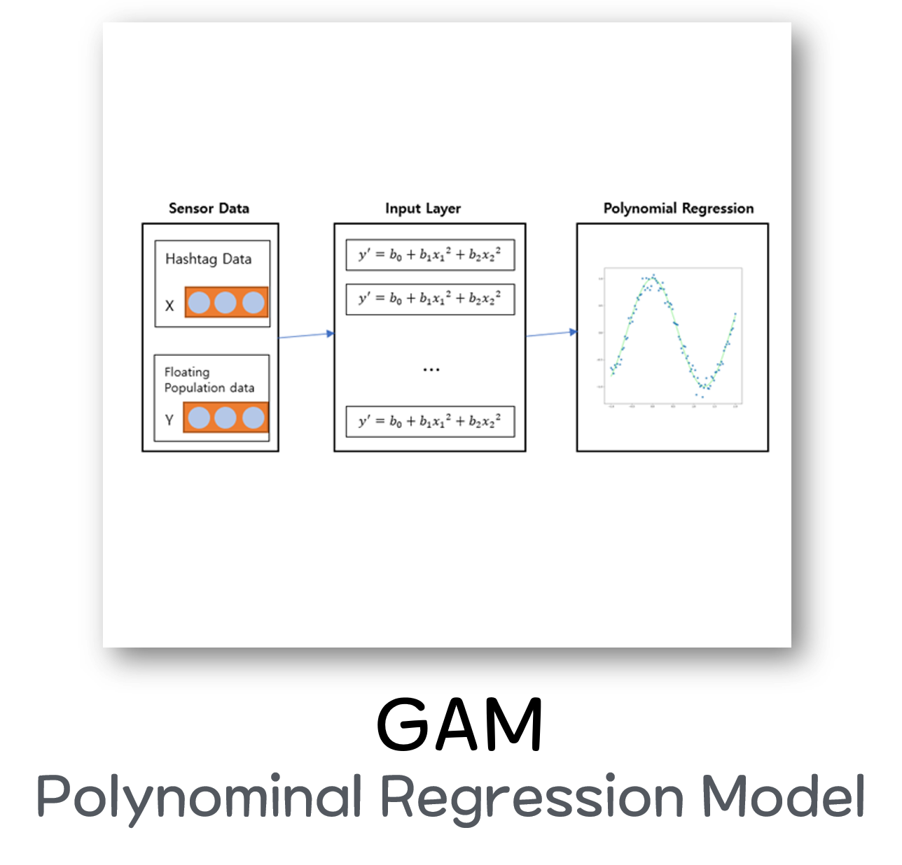
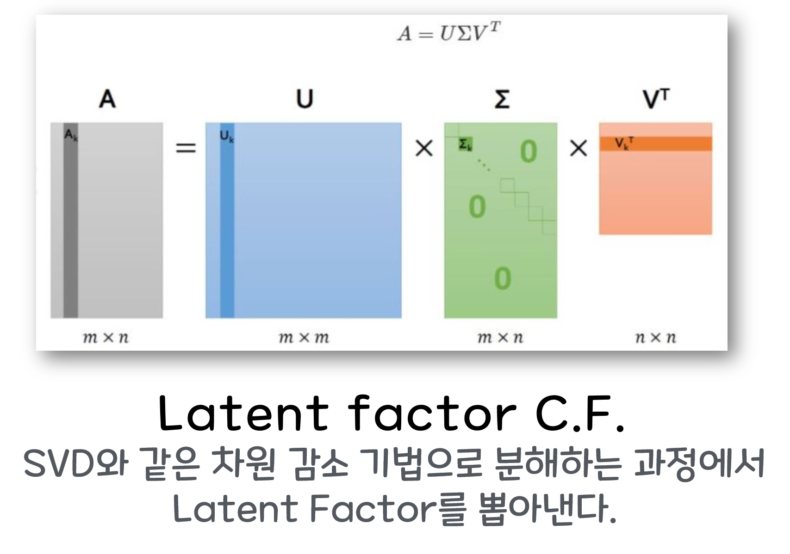

# 머신러닝 기능 소개

우아하게 음식에는 총 4개의 머신러닝 모델이 사용되었다. 그리고 각 모델은 여러가지의 데이터 소스를 기반으로 만들어졌다. 여기서는 만든 모델과 각 모델이 사용한 데이터셋을 소개하고자 한다. 이곳에서 소개하지 않는 것은 모델의 자세한 학습 방법 및 코드, 그리고 데이터의 자세한 전처리 방법이다. 이런 내용이 궁금하다면 다음을 참고하자.

1. [데이터 수집 코드](https://github.com/hankyul-needs-girfriends/woowa-crawler)
2. [데이터 전처리 및 머신러닝 모델 제작 코드](https://github.com/hankyul-needs-girfriends/woowa-ML)

3. 데이터 전처리의 자세한 과정 및 모델의 학습 방법에 대한 설명 : [report](https://github.com/hankyul-needs-girfriends/woowa-android-main-/blob/v1.0/docs/report.pdf)

이제 여기서 설명할 내용에 대한 소개이다. 여기서는 총 2가지를 소개 한다.

1. [데이터 출처](#데이터-출처)
2. [모델이 사용된 곳 및 모델의 구조](#모델-구조)

## 데이터 출처

데이터는 총 6개로 분류 할 수 있고 각 데이터에 대한 설명은 다음 그림에서 확인 할 수 있다.

## 모델 구조

총 4개의 모델이 사용되었고 사용된 모델에 대한 설명은 다음 그림으로 대신한다.

1. **word2vec 모델 구조**

2. **Doc2Vec**

3. **Regression**

4. **C.F.**

