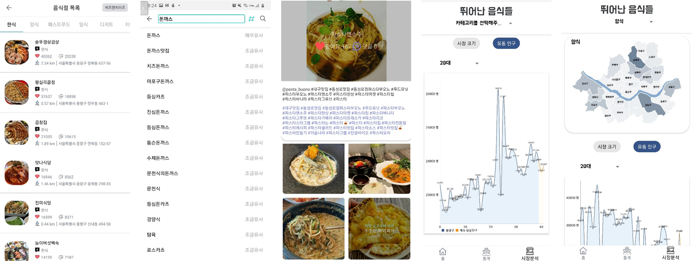
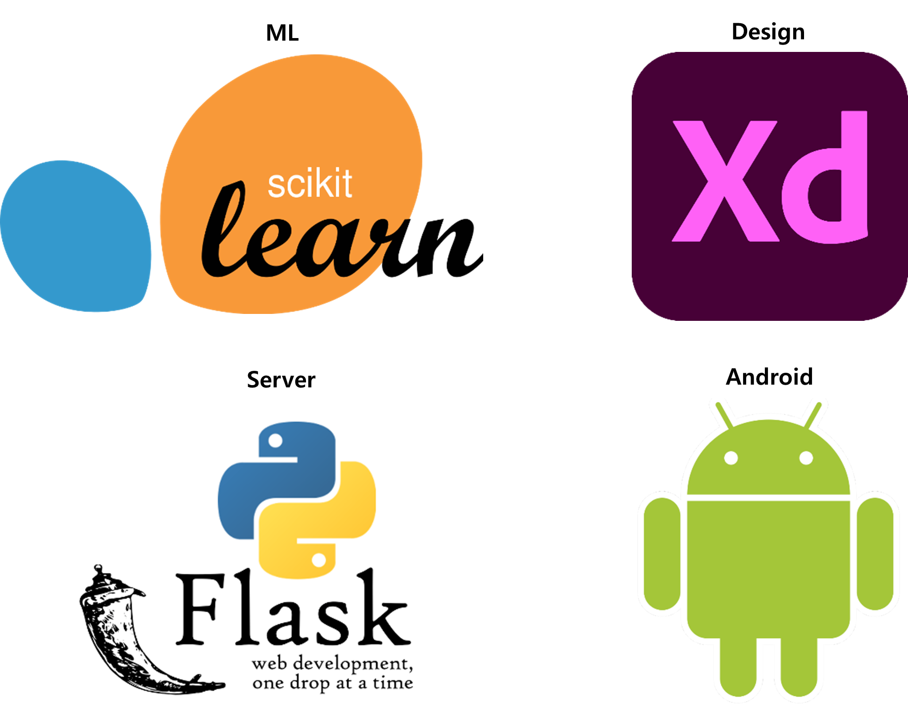

# 우아한 음식들 Read Me

<p align="center">
    
</p>
<h4 align="center">사용자 기반 음식 추천 & 요식업계 시장 분석 어플리케이션</h4>
<p align="center">
  <a href="#overview">Overview</a> • 
  <a href="#key-features">Key Features</a> • 
  <a href="#tutorial">Tutorial</a> •  
  <a href="#credits">Credits</a> •   
  <a href="#structure">Structure</a> • 
  <a href="#related">Related</a>
  <a href="#license">License</a>
</p>

<p align="center">
    이 어플리케이션은 2020년 아주대학교 집중 교육의 일환으로 제작되었습니다. 이 어플리케이션은 실제 상업적 목적이 포함되어 있지 않습니다. 전체적인 디자인 모티브로 배달의 민족 어플리케이션을 참고하였습니다. 이 프로젝트는 <a href="https://github.com/hankyul-needs-girfriends/woowa-appserver">서버</a>, <a href="https://github.com/hankyul-needs-girfriends/woowa-crawler">크롤링</a>, <a href="https://github.com/hankyul-needs-girfriends/woowa-ML">머신러닝</a> 레포와 같이 운영되어 왔습니다. 하지만 프로젝트의 주요 레포지토리는 이 레포지토리 입니다. 이 프로젝트는 강*결, 윤*은, 허*철의 도움으로 만들어졌습니다. 같이 고생한 팀원분들께 감사의 말을 전합니다.
</p>


<p align="center">
    <br/>
    <br/>
  <b>사용자 기반 음식 추천 기능 데모 영상</b>
</p>


<p align="center">
        <br/>
        <br/>
  <b>시장 분석 기능 데모 영상</b>
</p>


## Overview

‘우아하게’라는 어플은 소비자에게는 먹고 싶은 음식이나 유명한 음식점을 추천하고, 사장님이나 예비 창업가에게는 시장 크기를 보여주고 유동 인구수를 예측하는 데이터를 보여주고 싶었고 이를 반영하는 서비스를 만들게 되었습니다. 우아하게의 주요 기능 입니다. 자세한 기능 소개는 [여기서](docs/functionality.md) 확인 가능 합니다.

* 사용자 위치 지정 기능
* 검색어 추천 및 음식점/음식 검색 기능
* 사용자 지역기반 음식점 목록화 기능
* 사용자 기반 음식 추천 및 연관 음식 음식점 추천 기능
* 시장 동향 분석 기능
* 유동인구 예측 기능




## Tutorial

이 어플을 직접 사용하기 위해서는 우선 어플을 안드로이드 핸드폰에 설치하여야 한다. 어플을 설치하기 위해서는 [apk]() 파일을 다운 로드 해도 되지만 서버와 연결되어 있지 않기 때문에 이는 추천 하지 않는다. 직접 소스코드를 다운 받은 후 로컬 서버 주소를 적은 후에 빌드 시키는 방법이 확실하다. 따라서 어플을 설치 한 뒤에는 [서버]() 직접 열어야 한다. 서버를 설치하는 방법은 해당 [레포]()에 잘 정리되어 있으므로 참고 하길 바란다. (서버를 연 후에 꼭 동일한 와이파이 환경에서 구동시켜 주세요!)

1. 소스 코드 다운

```bash
git clone https://github.com/hankyul-needs-girfriends/android.git
```

2. 안드로이드 스튜디오에서 로컬 서버 주소 등록

```java
// httpConnection/RetrofitAdapter.java 코드 수정
public static RetrofitService getInstance(Context context) {
        String baseUrl = "http://192.168.25.8:5000/"; // 이 부분에 ipconfig로 확인한 로컬 서버 주소 입력

        Gson gson = new GsonBuilder()
                .setLenient()
                .create();
```

3. 로컬 서버 설치 (서버 레포 확인)
4. 어플 실행 및 놀아보기


## Credits

도담도담은 아래의 오픈 소스를 사용하여 제작되었다.

* [Android Studio](https://developer.android.com/studio)
* [N Cloud](https://www.ncloud.com/)
* [Kakao Developer](https://developers.kakao.com/)
* [Flask](https://flask.palletsprojects.com/en/1.1.x/)
* [Retrofit](https://square.github.io/retrofit/)
* [Firebase](https://firebase.google.com/)
* [Glide](https://github.com/bumptech/glide)


## Structure

전체 프로젝트의 구조는 다음 사진과 같이 되어 있다. 자세한 사항이 궁금하다면 [다음 문서]()를 확인할 것!

문서에는 다음과 같은 내용이 포함되어 있다.

1. 머신러닝 : 데이터 수집, 전처리 과정, 모델 설명
2. 디자인 : 디자인 규칙, 참고사항
3. 기능 설명 : 주요 기능 설명




## Related

* [우아한 음식들 서버](https://github.com/hankyul-needs-girfriends/woowa-appserver)
* [우아한 음식들 수집 관련 코드](https://github.com/hankyul-needs-girfriends/woowa-crawler)
* [우아한 음식들 머신러닝 관련 코드](https://github.com/hankyul-needs-girfriends/woowa-ML)

> 우아한 음식들의 자세한 설명을 듣고 싶다면 다음를 [report](.docs/report.pdf) 참고


## License

This application is freely available for free non-commercial use, and may be redistributed under these conditions. Please, see the [license](LICENSE) for further details.